# Implementation Plan for Code Review Recommendations

**Created:** October 14, 2025  
**Status:** IN PROGRESS

## Implementation Strategy

Changes are organized into 4 parallel tracks that can be implemented simultaneously, followed by integration and testing phases.

### Track 1: Build Configuration (CMake & WebView2)
**Estimated Time:** 30 minutes  
**Files:** `CMakeLists.txt`

- [x] Add WebView2 static linking configuration
- [x] Add WebView2 compile definitions
- [x] Configure WebGUI build automation
- [x] Add build dependencies

### Track 2: Backend Parameter Architecture
**Estimated Time:** 45 minutes  
**Files:** `PluginEditor.h`, `PluginEditor.cpp`, `PluginProcessor.h`, `PluginProcessor.cpp`

- [x] Implement WebSliderParameterAttachment system
- [x] Remove manual parameter listener code
- [x] Add proper WebView2 backend initialization
- [x] Optimize processBlock for real-time safety
- [x] Add undo manager to APVTS
- [x] Fix parameter range to industry standards

### Track 3: Frontend React Application
**Estimated Time:** 30 minutes  
**Files:** `WebGUI/ui/src/App.jsx`, `WebGUI/ui/src/main.jsx`, `WebGUI/ui/vite.config.js`

- [x] Remove non-existent onOff parameter
- [x] Update to use JUCE's built-in slider state API
- [x] Remove StrictMode for production
- [x] Clean up unused imports

### Track 4: Error Handling & Testing
**Estimated Time:** 45 minutes  
**Files:** `WebView.cpp`, `Tests/ParameterTests.cpp`, `Params.h`

- [x] Add error handling in WebView loading
- [x] Add parameter range tests
- [x] Add state persistence tests
- [x] Add processBlock safety tests
- [x] Update parameter constants if needed

### Track 5: Integration & Validation
**Estimated Time:** 20 minutes  
**Sequential after Tracks 1-4**

- [ ] Build and test compilation
- [ ] Run unit tests
- [ ] Verify WebView loads correctly
- [ ] Test parameter synchronization
- [ ] Update documentation

## Implementation Order

```mermaid
gantt
    title Implementation Timeline
    dateFormat  HH:mm
    axisFormat %H:%M

    section Track 1
    CMake Config           :t1, 00:00, 30m
    
    section Track 2
    Backend Changes        :t2, 00:00, 45m
    
    section Track 3
    Frontend Changes       :t3, 00:00, 30m
    
    section Track 4
    Error & Tests          :t4, 00:00, 45m
    
    section Integration
    Build & Test           :t5, 00:45, 20m
```

## Dependency Graph

- Track 1 (CMake) - Independent
- Track 2 (Backend) - Independent
- Track 3 (Frontend) - Independent
- Track 4 (Tests) - Independent
- Track 5 (Integration) - Depends on Tracks 1-4

## Risk Mitigation

1. **Build Failures:** Each track modifies different files, minimizing merge conflicts
2. **Breaking Changes:** Tests will validate functionality after integration
3. **Rollback:** Git commits for each track allow selective rollback

## Success Criteria

- [ ] Project builds without errors
- [ ] All unit tests pass
- [ ] WebView loads without errors
- [ ] Parameter automation works in DAW
- [ ] No real-time safety violations
- [ ] Documentation matches implementation

---

**Implementation Status:** ✅ ALL TRACKS COMPLETED - Ready for integration testing
